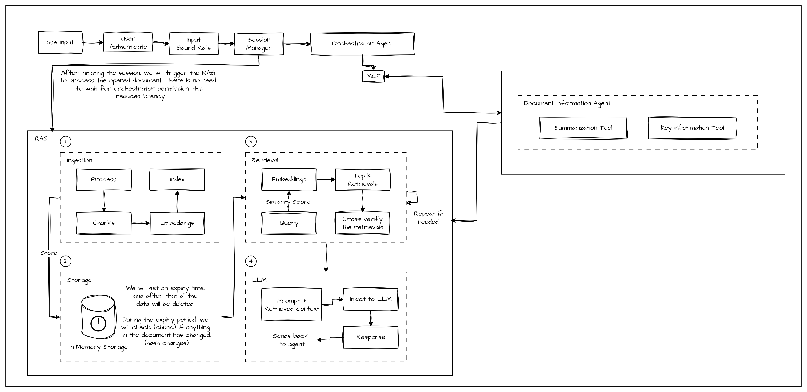

# Accorder AI — Contract Review Backend

FastAPI backend for AI-assisted contract review. Ingests DOCX contracts, extracts clauses, and exposes endpoints for summarization, key-information extraction, full analysis, document Q&A, playbook validation, comparison, drafting, and general review. LLM calls run on **Claude Opus 4.7 via AWS Bedrock**.

## Architecture overview



**Pipeline:** DOCX upload → semantic chunking + embedding → per-session FAISS index → endpoint-specific Claude call (forced tool-use for JSON-mode endpoints, streaming for everything) → schema-validated response.

**Tech stack:** Python 3.10, FastAPI, Uvicorn, Pydantic v2, FAISS (in-memory, per-session), sentence-transformers (MiniLM-L6-v2 for embeddings, runs locally), python-docx, langchain text splitters, boto3 for Bedrock, mustache prompt templates.

## Endpoints

| Endpoint | Purpose |
|---|---|
| `POST /api/v1/ingest/` | Ingest a DOCX into a session. |
| `GET /api/v1/DocInfo/summarizer` | Markdown summary of the ingested document. |
| `GET /api/v1/DocInfo/key-information` | Markdown key-information report. |
| `POST /api/v1/clause-extraction/extract-clauses/` | Pure-Python clause extraction (no LLM). |
| `POST /Accorder/agents/contract-analyzer` | Structured JSON analysis: summary + key info + timeline + risks. |
| `POST /Accorder/agents/query-document` | RAG: rewrite query, retrieve, answer. |
| `POST /Accorder/agents/general-review` | Suggestions for a selected clause or full document. |
| `POST /Accorder/agents/playbook-review` | Validate document against a set of rules. |
| `POST /Accorder/agents/compare-documents` | Multi-stage diff between two DOCX versions. |
| `POST /Accorder/agents/draft` | Draft a clause or full NDA. |
| `GET /admin/sessions/` and friends | Session admin (list, info, delete, cleanup, health). |

Every endpoint accepts an `X-Session-ID` header. The same ID ties multi-step flows together (ingest → analyze → query).

## Local setup (development)

Requires Python 3.10.x (use [uv](https://github.com/astral-sh/uv) or pyenv if your system Python is different).

```bash
# install dependencies
pip install poetry
poetry env use python3.10
poetry lock
poetry install

# configure
cp .env.example .env
# fill in BEDROCK_MODEL_ID and AWS credentials (see below)

# run
poetry run python -m src.api.main
# server listens on http://localhost:8000 by default
# Swagger UI at  http://localhost:8000/docs
```

### AWS credentials for local dev

`boto3` uses the standard credential chain. Pick one:

- **AWS CLI profile (cleanest):** run `aws configure` once. Nothing needed in `.env`.
- **`.env` variables:** add `AWS_ACCESS_KEY_ID` and `AWS_SECRET_ACCESS_KEY`. boto3 reads them automatically.

The IAM principal needs `bedrock:InvokeModel` and `bedrock:InvokeModelWithResponseStream` on the model/inference-profile ARN.

## EC2 deployment

The standard production target is an EC2 instance with an IAM role that has Bedrock access. No credentials in `.env` — the instance metadata service provides them automatically.

```bash
# on EC2
git clone <repo-url>
cd accorder-ai-backend

# install Python 3.10 if missing (Ubuntu 24.04+ ships newer)
curl -LsSf https://astral.sh/uv/install.sh | sh
uv python install 3.10

# install Poetry + deps
curl -sSL https://install.python-poetry.org | python3 -
poetry env use $(uv python find 3.10)
poetry lock
poetry install

# .env (no AWS creds needed — IAM role provides them)
cat > .env <<EOF
API_HOST=0.0.0.0
AWS_REGION=us-west-1
BEDROCK_MODEL_ID=<your inference profile ARN>
SESSION_TTL_MINUTES=120
SESSION_CLEANUP_INTERVAL_MINUTES=10.0
EOF

# run
poetry run python -m src.api.main
```

To allow external access (your laptop's browser → EC2:8000/docs):
1. Edit the EC2 security group → add inbound rule for TCP 8000, source = your laptop's IP.
2. Make sure `API_HOST=0.0.0.0` in `.env` (so the server listens on all interfaces).

## Configuration (.env)

| Variable | Default | Purpose |
|---|---|---|
| `API_HOST` | `0.0.0.0` | Bind interface. `0.0.0.0` listens on all interfaces (EC2/external). `localhost` for local-only. |
| `API_PORT` | `8000` | Port. |
| `DEBUG` | `false` | Verbose logging. |
| `CHUNK_SIZE` | `1000` | Max chunk size during DOCX parsing. |
| `CHUNK_OVERLAP` | `200` | Overlap between chunks. |
| `AWS_REGION` | `us-west-1` | Bedrock region. |
| `BEDROCK_MODEL_ID` | — (**required**) | Bedrock model id or inference-profile ARN. |
| `SESSION_TTL_MINUTES` | `120` | Session expiry. Defaults to 2 hours. |
| `SESSION_CLEANUP_INTERVAL_MINUTES` | `10.0` | How often the background worker checks for expired sessions. |

## Testing

Two smoke-test scripts ship with the repo:

```bash
# 1. Direct Bedrock connectivity check — confirms credentials, region, model id, IAM perms
poetry run python scripts/test_bedrock.py

# 2. End-to-end endpoint sweep — boots through every LLM-using endpoint with a sample DOCX
poetry run python scripts/create_test_docs.py     # generates two sample contracts
poetry run python -m src.api.main &               # start the server in the background (or another terminal)
poetry run python scripts/test_endpoints.py       # runs the 9-endpoint sweep
```

`test_endpoints.py` prints `[PASS]` / `[FAIL]` per endpoint and a final summary. On failure, it dumps the server response for debugging.

## Project layout

```
src/
  api/                              FastAPI app + routers
    main.py                         App entry point + middleware
    endpoints/                      Route handlers grouped by domain
  config/
    settings.py                     Pydantic settings (reads .env)
    logging.py                      Logging config + context-var filter
  exceptions/                       Typed exception hierarchy
  schemas/                          Pydantic request/response models
  services/
    ingestion/                      Document ingestion service
    llm/
      base_model.py                 Abstract LLM interface
      bedrock_model.py              Bedrock-backed implementation (streaming)
    registry/                       Parser registry (DOCX semantic parser)
    retrieval/                      Vector search + query rewrite + clause matching
    session_manager.py              Per-session in-memory state (FAISS + chunks)
    vector_store/                   FAISS wrapper + HuggingFace embeddings
    prompts/v1/                     Mustache prompt templates
    clause_extractor.py             Shared clause-extraction helpers
  tools/                            Domain-specific orchestrator functions used by endpoints
scripts/                            Smoke-test helpers
tests/                              Reserved for unit tests
```

## Design principles

- One conceptual unit per file.
- Prompts live as versioned `.mustache` files, never as inline strings.
- Every exception is a named subclass, never a bare `Exception`.
- Inputs and outputs are explicitly typed and Pydantic-validated.
- LLM calls go through `BaseLLMModel.generate(...)` — swapping the provider is one container line.
- Per-session state lives in `SessionManager`. No shared mutable globals for user data.

## Notes

- **Logs** are rotated by day to `logs/AI_Contract_Review_YYYYMMDD.log`. `errors.log` collects ERROR-level only.
- **Prompts** can be re-versioned by adding `src/services/prompts/v2/...` and changing the path in the caller.
- **Bedrock quota:** Claude Opus has a per-account TPS quota (~1–4 RPS by default for new accounts). Fan-out endpoints (`compare-documents`, `general-review`) may hit `ThrottlingException` under heavy load. Request a quota increase via AWS Service Quotas if needed.
